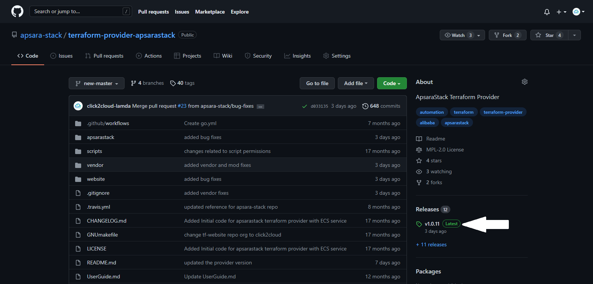
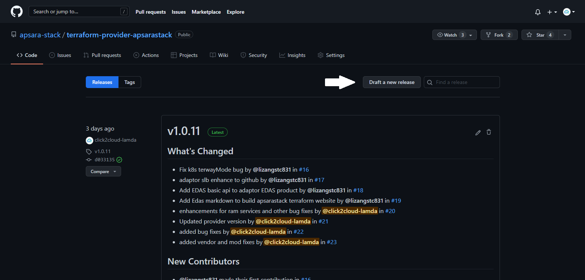
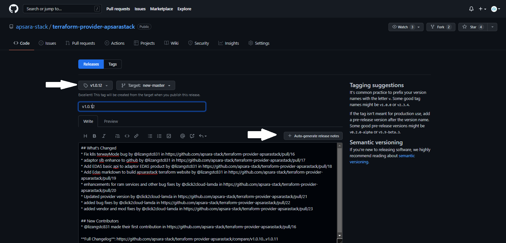
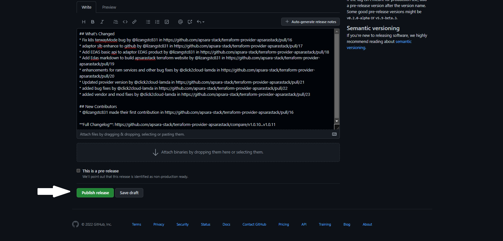
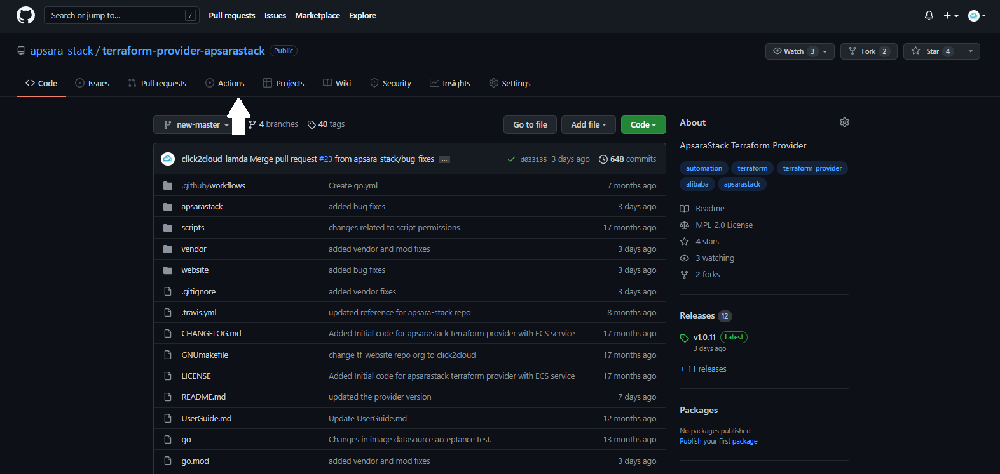
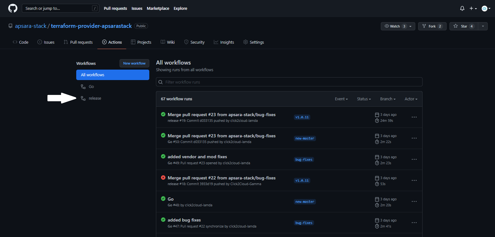

Terraform Provider Publish For ApsaraStack Cloud
==================

Document for ApsaraStack Terraform Provider Release
------------------

Following are the steps for Releasing ApsaraStack Terraform Provider

Step 1: Go to the Repo page and go to “Releases”.

Step 2: Click on “Draft a new release” to draft a new release version.

Step 3: Create and Add a new tag and click on “Auto-generate release notes” to add notes.

Step 4: Click on “Publish Release” to release the latest version.

Step 5: Now, go to code page and click on “Actions”.

Step 6: Now click on “release” to check the provider release process of the binaries to the Terraform registry.

